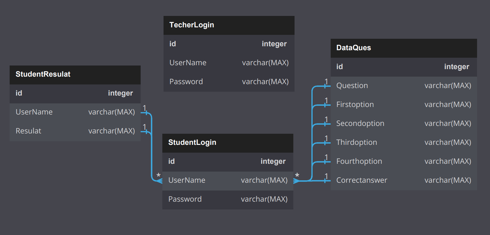

 
   
## MY QUIZ
   Have you ever thought about measuring the learning progress of your pupils or students by modern methods?
  Not by letting them fill out countless exam sheets
  Then my quiz  application might be the solution for you.

# Motivation

We have seen a huge change in our education system in the past few months during this disaster that we have experienced. With the use of the internet and many of the latest technologies, students can now access various online learning options. This has also led to online home exams.
So, in this new era of online education, I thought of creating this program 
 
 #  purpose
 
 Learn MS SQL commands, deal with databases, increase design skills, and work on software development.
   

   
  # Database
  
  

  ## programming language
   C#
